## 🧩 Retail Fraud Detection – Full Framework Summary

### 1. Problem Space
Retail Fraud Detection — focused on transaction, return, inventory, and loyalty frauds in both internal and external forms.

### 2. Fraud Type Decomposition

```mermaid
graph TD
  A[Retail Fraud Risk] --> B[Internal Fraud]
  A --> C[External Fraud]

  B --> D1[Inventory & Fulfillment Fraud]
  B --> D2[Insider / Collusion Fraud]
  C --> D3[Transaction Fraud]
  C --> D4[Promotion & Loyalty Fraud]
  C --> D5[Return & Refund Fraud]
  C --> D6[Digital & Channel-Specific Fraud]

  D1 --> E1[พนง.สลับสินค้าจริงเป็นของปลอม]
  D1 --> E2[รายงาน stock ผิดจากความจริง]
  D2 --> E3[ร่วมมือกับ supplier ปลอม order]
  D2 --> E4[แก้ไข stock/โปรโมชั่น เพื่อลบร่องรอย]
  D3 --> E5[ปลอม slip / การโอนเงิน]
  D3 --> E6[ออกใบเสร็จปลอม]
  D4 --> E7[ใช้คูปองซ้ำโดยเปลี่ยนบัญชี]
  D4 --> E8[บัญชีปลอมแลกของรางวัล]
  D5 --> E9[ส่งคืนของปลอม / กล่องเปล่า]
  D5 --> E10[พนักงานอนุมัติ refund ไม่ตรวจของ]
  D6 --> E11[ใช้ข้อมูลบัตรเครดิตที่ถูกขโมย]
```

### 3. Key Dimensions
| Dimension     | Factors                                           |
|---------------|---------------------------------------------------|
| Customer      | Repeat returns, fake accounts, nominee behavior  |
| Process       | Manual refund loop, override abuse, stock issues |
| Technology    | IP/device/email/shipping overlap, session links  |
| Finance       | Promo loss, refund %, fraud cost per order       |

### 4. Selected Models
| Type       | Model              | Purpose                       |
|------------|--------------------|-------------------------------|
| Analytical | Fishbone, PRA Tree | Identify root cause           |
| Behavioral | COM-B              | Understand fraud motivation   |
| Strategic  | 2x2 Matrix         | Prioritize by risk/impact     |
| Financial  | Unit Economics     | Quantify cost per event/order |
| Process    | Design Thinking    | Redesign detection process    |

### 5. Visualization
- ✅ Decomposition Diagram (Mermaid)
- ✅ 2x2 Matrix (Impact vs Risk)
- ✅ Refund Loop / Network Map

### 6. Hypotheses
- Users with similar emails/devices & same address may form a fraud ring
- Refunds during flash sales are prone to nominee insider abuse
- Repeat manual refunds by same employee suggest internal fraud risk

### 7. Data Sources
| Source         | Fields                          | Purpose                  |
|----------------|----------------------------------|--------------------------|
| Transactions   | Order ID, Timestamp              | Behavior pattern         |
| Fulfillment    | Stock log, Action by staff       | Insider or process gap   |
| Customer Data  | Email, IP, Device ID             | Fraud network detection  |
| Refund Records | Refund Reason, Approver          | Spot manipulation abuse  |
| Logs           | Alerts, Suspicious actions       | Monitor model accuracy   |

### 8. Playbook Phases
| Phase     | Action                     | Toolset                        |
|-----------|----------------------------|--------------------------------|
| Diagnose  | Map linkage + actors       | Stakeholder Map, PRA Tree     |
| Design    | Rule + ML hybrid plan      | Causal Loop, Behavior Model   |
| Execute   | Deploy detection pipeline  | Streaming Rules, Dashboards   |
| Monitor   | Track + retrain alerts     | KPI Reports, Alert Tuning     |
